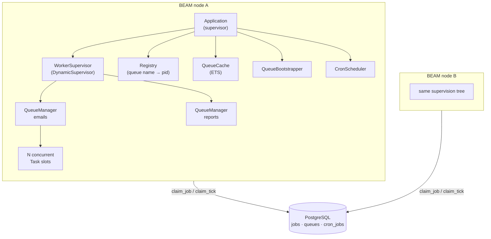

# Distributed Task Queue

**Background job processing that keeps running when a machine dies.**

Jobs are enqueued into PostgreSQL, claimed by worker processes across any number of BEAM nodes, retried with exponential backoff, and routed to a dead-letter queue once they exhaust their attempts. Scheduling is built in — cron expressions with real timezone and DST handling, or fixed intervals.

[](https://github.com/abwaocollins/distributed-task-queue/actions/workflows/ci.yml)


<!-- DEMO SLOT — live demo link and the kill-a-node GIF go here, above the fold. -->

---

## Why this exists

Elixir already has a mature job queue, and for production work you should use it. This project exists because I wanted to build the coordination primitives directly rather than consume them: exactly-one-claimer semantics under concurrency, safe scheduling across a cluster without a leader election, and failure handling that degrades predictably instead of silently.

The interesting parts are not the features — they are the two places where the obvious implementation was wrong, and the tests that proved it. See [Engineering notes](#engineering-notes).

## Architecture

Coordination lives in PostgreSQL, not in the cluster. Nodes never need to agree with each other, discover each other, or elect anything — they contend for rows. That trades peak throughput for a very small amount of distributed-systems surface area.



| Component | Responsibility |
|---|---|
| `QueueManager` | One GenServer per queue. Polls for claimable work, holds a fixed set of concurrency slots, traps exits so a crashed worker returns its slot. Self-terminates when idle. |
| `WorkerSupervisor` + `Registry` | Queues are started and stopped at runtime, addressed by name rather than pid. |
| `QueueCache` | GenServer-owned ETS table of queue metadata. `QueueManager` reads pause state from memory on every poll instead of hitting the database. |
| `QueueBootstrapper` | Starts a manager for every queue row at boot, via `handle_continue`. |
| `CronScheduler` | Self-scheduling poll loop. Runs on **every** node — safety comes from atomic tick claiming, not from being a singleton. |
| `Worker` | The behaviour user code implements, plus the dispatch trust boundary. |

### How a job flows

1. **Enqueue** — a row lands in `jobs` with status `pending`, a `worker_module` string, and a JSON payload.
2. **Claim** — the queue's `QueueManager` claims one row inside a transaction, using `SELECT … FOR UPDATE SKIP LOCKED` followed by a targeted `UPDATE` while the lock is still held. Status becomes `started` and `attempted_by` records which node took it.
3. **Dispatch** — `worker_module` is resolved to a real module (see [the trust boundary](#the-worker_module-trust-boundary)) and `perform/1` is called in a supervised task.
4. **Settle** — `:ok` marks the job `completed`. An error or a raise marks it `retryable` with `next_retry_at = now + min(15 × 2^attempts, 3600)` seconds, or `discarded` once `attempts` reaches `max_attempts`.
5. **Dead-letter** — discarded jobs are flagged `dead_letter: true`, keeping their original queue so they can be inspected and requeued.

**Delivery semantics:** at-least-once for jobs. Cron *ticks* are deliberately at-most-once — the schedule advances before the job is inserted, so a crash in that window drops one tick rather than double-firing it. That trade-off is commented at the call site.

## Capabilities

| | |
|---|---|
| **Race-safe claiming** | No two workers run the same job, verified against real concurrent connections rather than reasoned about |
| **Exponential backoff** | `min(15 × 2^attempts, 3600)` seconds, capped at one hour |
| **Dead-letter queue** | Exhausted jobs are retained and queryable; requeue one or all |
| **Queue pause / resume** | Stops claiming; in-flight jobs finish; the manager stays alive |
| **Runtime queue management** | Create, start, stop, and delete queues without a deploy |
| **Cron scheduling** | Cron expressions or fixed intervals, with timezone and DST handling |
| **Overlap policy** | Per-cron control over whether a run may start while the previous one is still going |
| **Crash isolation** | A worker crash returns its concurrency slot; it cannot take down the queue |
| **Future scheduling** | `scheduled_at` for one-off delayed jobs |
| **Telemetry** | `[:dtq, :job, …]` and `[:dtq, :cron, …]` events, wired into LiveDashboard |

## Defining a worker

Implement the behaviour and return `:ok` or `{:error, reason}`. Raising is also fine — it is caught and recorded as a failure.

```elixir
defmodule MyApp.EmailWorker do
  @behaviour DistributedTaskQueue.Worker

  @impl true
  def perform(%{"to" => to, "subject" => subject}) do
    case MyApp.Mailer.deliver(to, subject) do
      {:ok, _}      -> :ok
      {:error, err} -> {:error, err}
    end
  end
end
```

### The `worker_module` trust boundary

`worker_module` arrives as a string from client input on any deployment that exposes the HTTP API, which makes dispatch a security boundary. Two properties are enforced in `DistributedTaskQueue.Worker.resolve/1`:

- **No atom creation.** Resolution uses `Module.safe_concat/1`, which raises rather than interning an atom for a name the VM has never seen. `Module.concat/1` would mint one per call, and atoms are never garbage collected — an unbounded stream of unknown module names would exhaust the atom table and take the node down.
- **Opt-in only.** Exporting `perform/1` is not consent to be executed as a worker. The module must declare `@behaviour DistributedTaskQueue.Worker`. Without that check, *any* loaded module exporting `perform/1` is reachable with a caller-controlled payload.

Rejected dispatches fail the job with an explicit reason rather than crashing the queue.

## Enqueuing work

In Elixir:

```elixir
DistributedTaskQueue.add_queue(%{name: "emails", max_concurrent_jobs: 10})

DistributedTaskQueue.add_job("emails", %{
  worker_module: "MyApp.EmailWorker",
  payload: %{"to" => "someone@example.com", "subject" => "Hello"},
  max_attempts: 5
})
```

Over HTTP:

```bash
curl -X POST localhost:4000/api/queues \
  -H 'content-type: application/json' \
  -d '{"name": "emails", "max_concurrent_jobs": 10}'

curl -X POST localhost:4000/api/jobs \
  -H 'content-type: application/json' \
  -d '{"queue_name": "emails",
       "worker_module": "MyApp.EmailWorker",
       "payload": {"to": "someone@example.com"}}'
```

### HTTP API

| Method | Path | Purpose |
|---|---|---|
| `GET` | `/api/queues` | List queues |
| `POST` | `/api/queues` | Create a queue |
| `POST` | `/api/queues/:name/start` | Start a queue's manager |
| `POST` | `/api/queues/:name/stop` | Stop a queue's manager |
| `DELETE` | `/api/queues/:name` | Delete a queue and cascade its jobs |
| `GET` | `/api/jobs` | List jobs (filterable) |
| `GET` | `/api/jobs/:id` | Fetch one job |
| `POST` | `/api/jobs` | Enqueue a job |
| `DELETE` | `/api/jobs/:id` | Soft-delete a job |
| `POST` | `/api/jobs/:id/requeue` | Requeue one dead-lettered job |
| `POST` | `/api/jobs/requeue_dead_letter` | Requeue every dead-lettered job |

Responses use conventional status codes — `404` for missing resources, `409` for conflicting state transitions, `422` for changeset errors, and idempotent `200`s where repeating a call is harmless.

## Scheduled jobs

A cron job declares **either** a `cron_expression` **or** an `interval_seconds`, never both — enforced by a database check constraint (`num_nonnulls(cron_expression, interval_seconds) = 1`), not only by the changeset.

```elixir
config :distributed_task_queue, :cron_jobs, [
  %{
    name: "daily_report",
    worker_module: "MyApp.DailyReportWorker",
    queue_name: "reports",
    cron_expression: "0 9 * * *",
    timezone: "Africa/Nairobi",
    payload: %{}
  },
  %{
    name: "cleanup",
    worker_module: "MyApp.CleanupWorker",
    queue_name: "low",
    interval_seconds: 3600,
    payload: %{}
  }
]
```

Entries are upserted on `name` at boot. `next_run_at` is only recomputed when the schedule itself changed, so redeploying does not indefinitely defer a job that is due.

**Timezones are resolved at schedule time and stored as UTC.** DST edges are handled explicitly rather than left to crash twice a year: a time that falls in a spring-forward gap resolves to the instant the clock jumps to, and an ambiguous autumn time resolves to the first occurrence. Setting a `timezone` on an interval-based schedule — where it would silently mean nothing — is rejected by a check constraint.

**Running the scheduler on every node is safe.** Before enqueuing, a node claims the tick with a conditional update:

```sql
UPDATE cron_jobs SET next_run_at = ..., last_run_at = ...
 WHERE id = $1 AND enabled AND next_run_at <= now()
```

PostgreSQL serialises the row write, so exactly one node sees `count == 1` and owns that tick. No leader election, no `:global`, no singleton process to supervise.

## Engineering notes

The two most useful things in this repository are the bugs.

### Job claiming was not race-safe

The original claim was a single statement:

```sql
UPDATE jobs AS j0 SET worker_id = ..., status = 'started'
 WHERE j0.id IN (SELECT sj0.id FROM jobs AS sj0
                  WHERE sj0.worker_id IS NULL AND ... LIMIT 1)
```

Every guard lived in the subquery, which scans `jobs` under a *different* range-table entry. Under `READ COMMITTED`, an `UPDATE` that blocks on another transaction's row lock re-evaluates its `WHERE` clause against the newly committed row — but that substitution applies only to the relation the `UPDATE` targets. The subquery re-ran against the old snapshot, still returned the same id, and the second claimer updated the row anyway. Both workers ran the job, and because `attempted_by` kept only the last writer, **the duplicate left no trace in the data.**

The first fix — adding `FOR UPDATE SKIP LOCKED` to the subquery — stopped the double-claim and introduced something worse. PostgreSQL may evaluate that subplan once per candidate row, and with `SKIP LOCKED` each evaluation can return a different id, so one statement marked several rows `started`. The code matched on a single row, fell through to `{:error, :no_jobs}`, and left those rows stranded in `started` with nobody running them.

What shipped is a select-then-update inside a transaction, so the lock is held across both statements and there is nothing to re-evaluate. Measured over 40 trials of 5 jobs against 5 concurrent claimers: **0 duplicates, 0 stranded, 0 lost, 5 of 5 claimed every trial.** The broken version managed 3–4.

The test module for this opts out of the Ecto sandbox deliberately — the sandbox hands every process in a test the same connection, so anything that *looks* concurrent is silently serialised and proves nothing. Locks are held from a raw Postgrex connection to force the exact interleaving rather than hoping for it.

→ [Full writeup: race-safe job claiming](docs/engineering/race-safe-job-claiming.md) — the SQL, the forced interleaving, and the failed first fix in detail.

### A cron job silently disabled itself

A cron pointed at a queue name that had no corresponding row. Enqueuing succeeded — the changeset validated that `queue_name` was *present*, never that the queue existed — and the helper meant to start a manager for it returned `:ok` after doing nothing. The job was unclaimable forever, and because the cron's overlap policy saw a permanently `pending` previous run, it never fired again. It ran exactly once and stopped, logging only the symptom.

The fix was to make the impossible state unreachable and loud: the scheduler now checks for a missing queue *before* claiming the tick, so no orphan job is created and `next_run_at` is left unclaimed — meaning the cron self-heals the moment the queue is created. Boot logs every enabled cron whose target queue is absent, at `error` level, with the remedy in the message.

The broader lesson is in the class of bug, not the instance: the failure mode is not "a worker died mid-run", it is **"a job that can never be claimed"** — which includes anything enqueued into a queue with no running manager.

→ [Full writeup: the cron wedge incident](docs/engineering/cron-wedge-incident.md) — the investigation, the fixes, and the design correction it forced.

## Observability

Telemetry events are emitted for every job and cron transition and registered as LiveDashboard metrics:

| Event | Measurements | Metadata |
|---|---|---|
| `[:dtq, :job, :started]` | `system_time` | `job_id`, `queue_name`, `worker_module` |
| `[:dtq, :job, :completed]` | `duration` | `job_id`, `queue_name`, `worker_module` |
| `[:dtq, :job, :failed]` | `duration` | …plus `reason` |
| `[:dtq, :cron, :fired]` | | `cron_job_id`, `name` |
| `[:dtq, :cron, :skipped]` | | …plus `reason` (`:queue_paused`, `:previous_run_active`, `:queue_missing`) |
| `[:dtq, :cron, :failed]` | | …plus `reason` |

`:skipped` carrying a reason is what turned the cron incident above from invisible into diagnosable.

## Testing

```bash
mix test              # full suite
mix coveralls.html    # coverage report
mix credo             # linting
mix dialyzer          # type checking
```

Roughly 2,000 lines of tests against 2,800 lines of application code, covering controllers, the bootstrapper, cron scheduling and overlap policy, the ETS cache, pause semantics, worker dispatch and its security boundary, and a dedicated concurrency suite that drives real parallel connections. CI runs the suite against PostgreSQL on every push and pull request.

## Running locally

Requires Elixir ~> 1.15, OTP 25+, and PostgreSQL 14+.

```bash
mix setup       # deps, database create + migrate, assets
mix phx.server  # http://localhost:4000
```

`/dev/dashboard` exposes LiveDashboard in development, including the `dtq.*` metrics above.

## Known limitations

Deliberately listed, because they are the questions worth asking:

- **The HTTP API has no authentication.** Fine behind a private network; not fine on the public internet.
- **Orphaned jobs are not reaped.** A job whose node dies mid-run stays `started` indefinitely. Deciding a job is dead needs a lease, a heartbeat, or a max-runtime threshold — the telemetry above makes the stall visible, but nothing clears it yet.
- **Enqueuing does not verify the queue is running.** The cron path guards this; `POST /api/jobs` does not, and inherits the wedge described above.
- **Clustering is configured but not yet demonstrated.** `DNSCluster` is wired into the supervision tree and defaults to `:ignore`. Multi-node coordination is correct by construction — every claim path is a row contention — but the deployed proof is still to come.
- **Throughput has a ceiling.** Coordinating through row locks means the database is the bottleneck under a single hot queue. That is the accepted cost of not running a broker.
