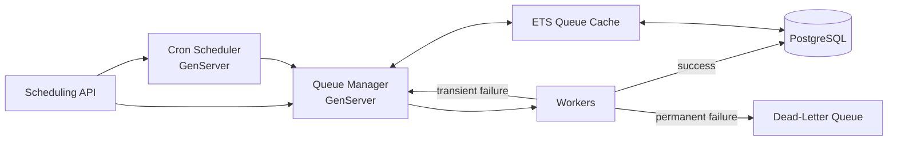

# [Project name]: Distributed Job Queue in Elixir/OTP

A background job processing system built from first principles to explore how tools like
Oban work under the hood: supervision, scheduling, retries, and failure handling.

I used Oban in production for three years. This project is me building the core ideas myself.

## Architecture



## Features
- [x] Job, cron job and queue schemas (Ecto + PostgreSQL)
- [x] Queue manager GenServer for normal jobs
- [x] Cron scheduler supporting intervals and cron expressions
- [x] ETS-backed queue cache to avoid repeated DB reads
- [x] Dead-letter queue for failed jobs
- [x] Bootstrapper that monitors application startup
- [ ] Retries with exponential backoff
- [ ] Failure classification (transient retried, permanent dead-lettered)
- [ ] API authentication
- [ ] Telemetry events
- [ ] Multi-node support via PubSub cache invalidation

## Design decisions
**Why an ETS cache?** Queue metadata is read on every dispatch. ETS gives fast concurrent
reads without hitting PostgreSQL each time. [Explain your invalidation approach.]

**Why separate GenServers for cron and normal jobs?** [Your reasoning.]

**What happens when a job fails?** [Explain the flow.]

## Running locally
```bash
mix deps.get
mix ecto.setup
mix phx.server   # or iex -S mix
```

## Example
```bash
curl -X POST localhost:4000/api/jobs \
  -H "Content-Type: application/json" \
  -d '{"queue": "default", "worker": "MyWorker", "args": {}}'
```

## What I'd build next
[Multi-node, a LiveView dashboard for queue state, rate limiting per queue.]
